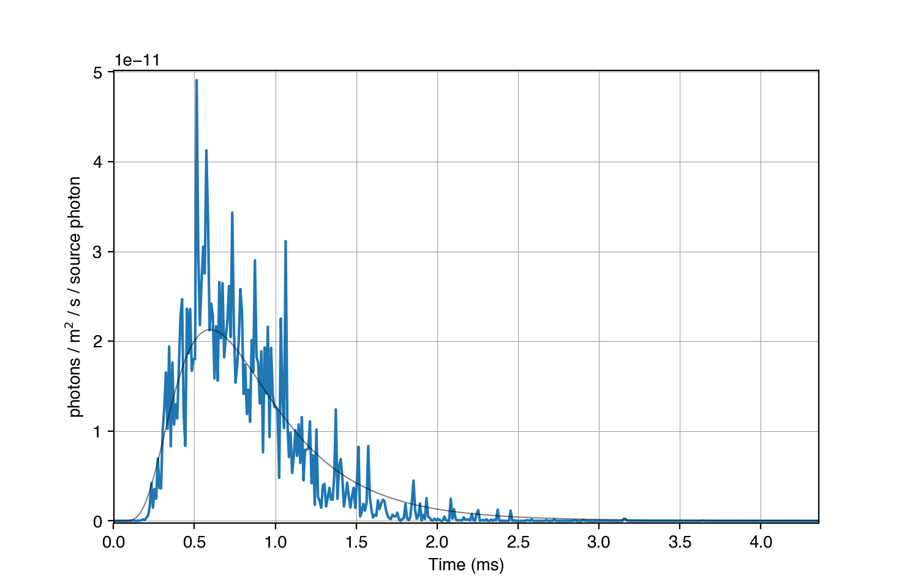

# CloudScat.jl

*Cloud-scattering code*

**CloudScat** is a Montecarlo code that predicts the signal observed by a satellite due to an optical source located inside or above a thundercloud.  It considers both Rayleigh (molecular) scattering and Mie scattering with cloud droplets.


## Install

The code is distributed as a [julia](https://julialang.org) package.  To install it, after you have downloaded and installed julia, start julia and go into the package manager by pressing `]`.  Then type

```julia
add http://gitlab.com/aluque/cloudscat
```

## Use

To start a simulation from the julia prompt use

```julia
julia> import CloudScat
julia> CloudScat.runfromfile("input_file.yaml")
```

where `input_file.yaml` is your input file defining the cloud geometry and optical properties. There is a explanatory example in the `samples` folder of the repository. If you have a multi-core cpu you can tell julia to use several threads to accelerate the computation.  For example to use 4 threads start julia with

```bash
> JULIA_NUM_THREADS=4 julia
```


If the simulation finishes correctly it produces a file called `input_file.h5` that contains the output data from the simulation. To view this output you can use one of the scripts contained in the `util` folder of the repo. For example to plot the simulated photometer data of observer one uses

```bash
> python plot_photo.py input_file.h5 --observer=1
```

To see the image recorded by the same observer use
```bash
> python plot_image input_file.h5 --observer=1
```

## Example

The sample input file `input_file.yaml` should produce an observed signal that looks something like this:



## Extras

The repository also contains code to calculate parameters for Mie and Rayleigh scattering.

### Rayleigh scattering

To calculate the cross section for Rayleigh scattering at any wavelength (e.g. 777 nm) type in the julia prompt
```julia
julia> import CloudScat.Ray
julia> Ray.rayleigh(777e-9) 
1.1096322607590443e-31
```

### Mie scattering
The parameters for Mie scattering can be calculated using the `PyMieScatt` python package.  Install it with
```bash
pip install PyMieScatt
```
And then use the script `mie.py` to calculate the parameters required for a MC simulation. The refractive index of water is read from the file `Hale.dat`.

